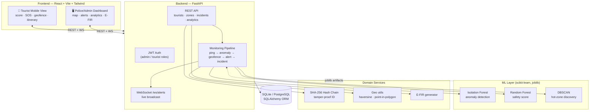
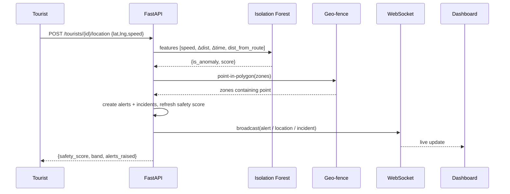
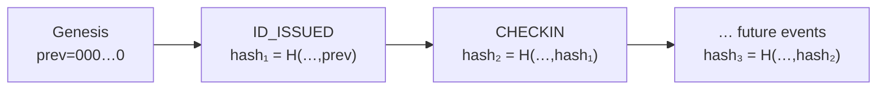

# 🛡️ Smart Tourist Safety Monitoring & Incident Response System

A full-stack AI/ML system that issues **tamper-proof digital tourist IDs**, monitors
tourist movement in real time, detects anomalies with machine learning, computes a
dynamic **safety score**, enforces **geo-fences**, handles **SOS/panic** events, and
drives a complete **incident-response workflow** — with a live police/admin dashboard
and a responsive tourist mobile view.

> B.Tech AI/ML major project. Backend: **FastAPI + SQLAlchemy + scikit-learn**.
> Frontend: **React (Vite) + Tailwind + Leaflet + Recharts**. Real-time via **WebSockets**.

---

## Table of Contents
1. [Feature Overview](#feature-overview)
2. [Architecture](#architecture)
3. [Tech Stack](#tech-stack)
4. [Project Structure](#project-structure)
5. [Setup & Run](#setup--run)
6. [Live Demo Mode](#live-demo-mode)
7. [The ML Models (features, training, evaluation)](#the-ml-models)
8. [Digital ID Hash-Chain](#digital-id-hash-chain)
9. [API Reference](#api-reference)
10. [Demo Accounts](#demo-accounts)

---

## Feature Overview

| # | Feature | How it works |
|---|---------|--------------|
| 1 | **Digital Tourist ID** | KYC registration → unique `STS-XXXX` ID + QR code. Records stored as a **SHA-256 linked hash chain** (blockchain-style, tamper-evident). ID validity tied to trip dates. |
| 2 | **AI Anomaly Detection** | **Isolation Forest** flags sudden location drop-off, prolonged inactivity, and abnormal speed (abduction pattern). **Route-deviation** via distance-to-itinerary. **DBSCAN** clusters historical incidents into auto high-risk zones. |
| 3 | **Safety Score (0–100)** | **Random Forest regressor** on zone risk, time-of-day, anomaly score, crime index, weather (mock). Live, color-coded. |
| 4 | **Geo-fencing & Alerts** | Polygon zones + **point-in-polygon** (Shapely). Entering a high-risk/restricted zone auto-alerts tourist + dashboard over **WebSocket**. |
| 5 | **Panic / SOS** | One-tap SOS → nearest available police unit auto-dispatched, emergency contacts notified, **critical incident** created. |
| 6 | **Police/Admin Dashboard** | Live Leaflet map of all tourists + risk heat circles, real-time alert feed, tourist search by digital ID, **auto E-FIR** draft for missing persons, analytics charts. |
| 7 | **Tourist Mobile View** | Responsive page: safety score gauge, zone status, itinerary tracker, SOS, nearby police, opt-in live-tracking toggle. |
| 8 | **Incident Workflow** | Lifecycle `detected → acknowledged → dispatched → resolved`, ML/rule severity classification, response-time tracking. |

---

## Architecture



### Monitoring pipeline (per GPS ping)



---

## Tech Stack

- **Backend:** Python 3.11, FastAPI, SQLAlchemy 2, Pydantic v2, JWT (python-jose), bcrypt
- **ML:** scikit-learn (IsolationForest, DBSCAN, RandomForestRegressor), pandas, numpy, joblib
- **Geo:** Shapely (point-in-polygon), haversine
- **DB:** SQLite (dev) — swap `DATABASE_URL` for PostgreSQL
- **Frontend:** React 18, Vite, Tailwind CSS, React-Leaflet, Recharts, Axios
- **Real-time:** native WebSockets

---

## Project Structure

```
major project/
├── backend/
│   ├── app/
│   │   ├── main.py              # FastAPI app + router wiring
│   │   ├── core/               # config, security (JWT, bcrypt)
│   │   ├── db/                 # SQLAlchemy engine/session
│   │   ├── models/            # ORM: tourist, zone, incident, alert, police, user
│   │   ├── schemas/           # Pydantic request/response models
│   │   ├── api/               # routers: auth, tourists, zones, incidents, analytics, ws
│   │   ├── services/          # hashchain, geo, ml_service, safety, monitoring, efir
│   │   ├── websocket/         # connection manager
│   │   ├── ml/                # ⭐ data generation + model training scripts
│   │   └── scripts/           # seed.py, simulate.py (live demo)
│   ├── ml_models/             # saved *.joblib + metrics.json + hotzones.json
│   └── requirements.txt
├── frontend/
│   └── src/
│       ├── pages/admin/       # Dashboard, TouristSearch, Incidents, Analytics
│       ├── pages/tourist/     # TouristApp (mobile view)
│       └── components/        # ui, mapIcons, geo
└── README.md
```

---

## Setup & Run

> Prerequisites: **Python 3.11** and **Node 18+**. (Python 3.11 is recommended — the
> ML wheels install cleanly there.)

### 1. Backend

```bash
cd backend
py -3.11 -m venv venv            # Windows;  python3.11 -m venv venv on macOS/Linux
venv\Scripts\activate            # source venv/bin/activate on macOS/Linux
pip install -r requirements.txt

# Train ML models (writes ml_models/*.joblib + metrics.json)
python -m app.ml.train_all

# Seed demo data (tourists, zones, police units, incidents)
python -m app.scripts.seed

# Run the API (http://127.0.0.1:8000 , docs at /docs)
python -m uvicorn app.main:app --reload
```

### 2. Frontend

```bash
cd frontend
npm install
npm run dev                      # http://localhost:5173
```

Open **http://localhost:5173** and log in with a [demo account](#demo-accounts).
Vite proxies `/api` and `/ws` to the backend automatically.

---

## Live Demo Mode

With the backend running, drive fake tourists around the map and trigger scripted
anomalies so the dashboard lights up during a presentation:

```bash
cd backend
python -m app.scripts.simulate                 # 40 steps, 2s interval
python -m app.scripts.simulate --steps 120 --interval 1
```

Scripted events: high-speed **abduction pattern** (step 8), **geo-fence** entry into a
high-risk zone (step 14), **prolonged inactivity** anomaly (step 20), and a **SOS** with
auto-dispatch (step 26). Keep the admin **Live Dashboard** open to watch alerts stream in.

---

## The ML Models

All three models train on **reproducible synthetic data** (`app/ml/generate_data.py`,
fixed seed) and are saved with joblib. The API loads them lazily and degrades to
rule-based fallbacks if an artifact is missing, so a demo never crashes.
Re-run everything and regenerate metrics with `python -m app.ml.train_all`.

### 1) Isolation Forest — Anomaly Detection *(unsupervised)*

- **Goal:** flag abnormal movement — sudden location drop-off/jump, prolonged
  inactivity, and unusual speed (possible vehicle abduction).
- **Features (per ping):** `speed_kmh`, `dist_from_prev_m`, `inactivity_min`,
  `dist_from_route_m`. Standard-scaled; ordering shared by training & inference
  (`ml_service.anomaly_features`).
- **Why Isolation Forest:** anomalies are rare and unlabeled in the real world; the
  forest isolates outliers by random partitioning without needing labels. We inject
  a labeled test set purely to *evaluate*.
- **Evaluation (25% hold-out, synthetic):**

  | precision | recall | F1 | ROC-AUC |
  |-----------|--------|----|---------|
  | **0.96** | **0.96** | **0.96** | **0.9996** |

  A `decision_function` score is squashed to a 0–1 anomaly probability for the UI.

### 2) Random Forest Regressor — Safety Score

- **Goal:** a continuous **0–100** safety score (higher = safer), updated live.
- **Features:** `zone_risk`, `hour` (time of day), `anomaly_score`, `crime_index`
  (mock), `weather_risk` (mock).
- **Target:** a weighted risk formula (+ noise); the forest learns and generalises it,
  matching the brief's "weighted model" while remaining a trainable ML artifact.
- **Evaluation (25% hold-out):** **R² = 0.899**, **MAE = 3.68** points.
- **Feature importances:** zone_risk 0.37, anomaly_score 0.27, crime_index 0.25,
  hour 0.06, weather_risk 0.05 — i.e. *where* you are and *how anomalously you move*
  dominate the score, which matches domain intuition.

### 3) DBSCAN — High-Risk Zone Discovery *(clustering)*

- **Goal:** auto-identify high-risk zones from historical incident coordinates.
- **Input:** incident lat/lng points (dense hotspots + scattered noise).
- **Params:** `eps = 0.005°` (~0.55 km), `min_samples = 12`. DBSCAN finds dense
  clusters and labels sparse points as noise (no need to pre-set *k*).
- **Output:** each cluster → convex-hull polygon in `ml_models/hotzones.json`,
  imported by the seed script as `source="auto"` **Zone** rows shown on the map.
- **Evaluation:** **4 clusters** recovered, **silhouette = 0.878** (well-separated),
  64 noise points correctly excluded.

> **On the near-perfect anomaly metrics:** the synthetic anomaly scenarios are
> deliberately extreme (abduction-speed, long inactivity, large jumps) with a
> *borderline* band of normal outliers mixed in, so the classes overlap enough for
> honest ~0.96 metrics rather than a suspicious 1.00. On messy real GPS data expect
> lower recall; the pipeline is built to be retrained on real traces.

---

## Digital ID Hash-Chain

Each tourist owns an append-only chain of `IdBlock` rows. Every block stores
`hash = SHA256(index | timestamp | event | data | previous_hash)`, linking to the
previous block's hash — so editing any historical record breaks every subsequent
hash. `GET /tourists/{id}/chain/verify` recomputes the links and reports tamper
status. This simulates a blockchain locally (no external chain needed).



---

## API Reference

Interactive docs at **`/docs`** (Swagger). Key endpoints:

| Method | Path | Purpose |
|--------|------|---------|
| POST | `/api/auth/login` | JWT login (OAuth2 password flow) |
| POST | `/api/tourists` | Register tourist + mint digital ID |
| GET | `/api/tourists/{id}/qr` | QR code (base64 PNG) |
| GET | `/api/tourists/{id}/chain/verify` | Verify hash chain integrity |
| POST | `/api/tourists/{id}/location` | Ingest GPS ping → full pipeline |
| GET | `/api/tourists/{id}/safety-score` | Live safety score + breakdown |
| POST | `/api/tourists/{id}/sos` | Panic/SOS → dispatch nearest unit |
| POST | `/api/tourists/{id}/mark-missing` | Mark missing + auto E-FIR |
| GET | `/api/zones` · POST | List / create geo-fence polygons |
| GET | `/api/alerts` | Alert feed |
| GET/PATCH | `/api/incidents` | Incident list / advance lifecycle |
| GET | `/api/analytics/*` | Summary, over-time, by-type, zone-risk, severity |
| WS | `/ws/alerts` | Live alert/location/incident stream |

---

## Demo Accounts

| Role | Email | Password |
|------|-------|----------|
| **Police / Admin** | `admin@tourism.gov.in` | `admin123` |
| **Tourist** | `aarav@example.com` | `tourist123` |
| Tourist | `emma@example.com` / `rohan@…` / `sofia@…` / `kenji@…` | `tourist123` |

---

### Academic notes / evaluation checklist
- **Models:** documented above with features, rationale, and metrics (precision/recall/F1/ROC-AUC, R²/MAE, silhouette).
- **Reproducibility:** fixed seeds; `python -m app.ml.train_all` regenerates `metrics.json`.
- **Explainability:** safety score returns a per-factor breakdown; anomaly reasons are human-readable.
- **Data privacy:** documents are stored masked/mock; live tracking is opt-in.
"# major-project" 
